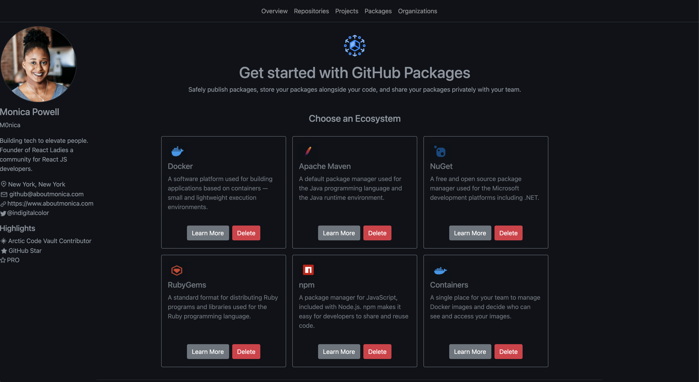
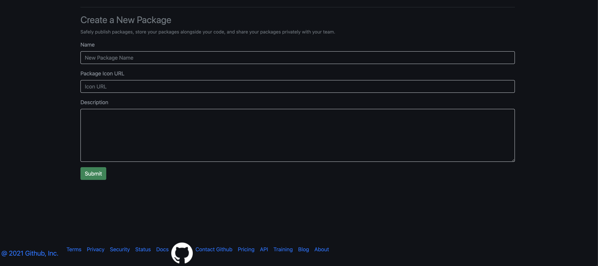
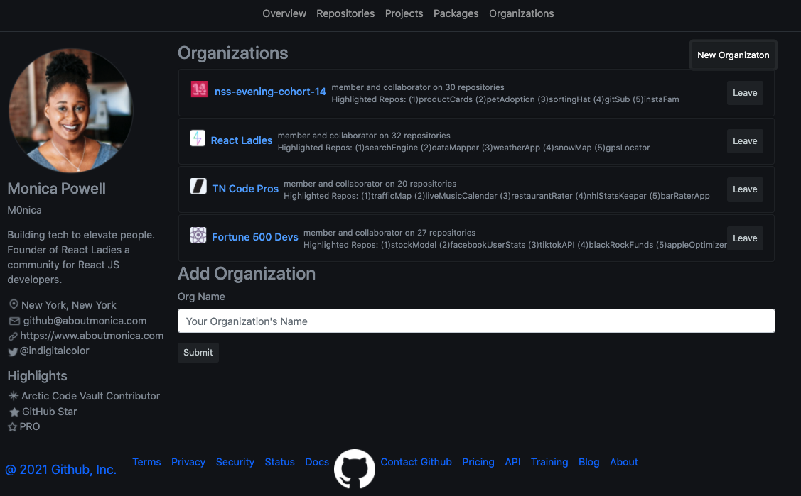

# GITSUB 
# Overview of the project  
To make a GitHub clone site 
# Link to your wireframes/prototype
1. [Main Project](https://www.figma.com/file/8vIX1yEXd2UxdWARbWqAje/GitSub?node-id=0%3A1)
2. [Additional Organizations Page](https://www.figma.com/file/V64DhnLjKDpvmE4kjt6tEs/GitSub-Copy?node-id=5%3A20)
# Link to the deployed project
https://team2-gitsub.netlify.app/

# Link to your project board
[Project Board](https://github.com/nss-evening-cohort-14/gitsub-e14-team-2-electric-boogaloo/projects/2)
# Description of the user
For user to see various aspects of their GitSub profile including:
- Overview Page
- Repositories Page
- Projects Page
- Packages Page
- Organizations Page
# List of features
0. Available on All Pages
- Profile Card
- Nav Bar
- Footer
1. Overview Page
- Profile card, which appears on every page.
- About Me section that gives an overview of the user, contact information, and an avatar specific to her.
- Container for pinned repos, with delete functionality
- Form for creating new pins or highlights.
2. Repositories Page
3. Projects Page
- Includes cards with 5 projects which contain the project name, description and date
- A Form to add a new project 
- The name field displays a message if the field is not filled
- Projects can be sorted from newest to oldest
- the form resets after the button is clicked 
4. Packages Page
- A flexbox row with Profile card and header containing titles/logos for Packages
- A flexbox column containg the package cards and form to create new packages
- Ability to create and delete packages
- Reponsive design for mobile use
- 
5. Organizations Page
- One flexbox div for responsive design, which holds two columns, the second column has multiple rows
- First column for Profile Card
- Second column, first row for Oranizations cards
- Second column, second row for a Form
- A New Organizations button which toggles Form's display between none and block
- A form which accepts a required Org name, and populates a new Org card upon submission
- Ability to Leave organizations, and thus delete the card
- Showcases on each card the top favorited repos from that Org (complex data)
# Screenshots of your project
- Overview Page

- Repositories Page

- Projects Page

- Packages Page

- Organizations Page

# List of contributors and links to their GH profiles
@Gabrielle-Tobermann
@GonzalesMatthew
@hmparsons-sde
@HunterJuneau
@seancrossettie
# Link to Loom video walkthrough of your app
- [INSERT SEPARATE LINKS TO LOOM VIDEOS]
- [Overview Page](https://www.loom.com/share/8e2f287f88aa4a0e90e30aa41107b6f5)
- [Repositories Page]()
<<<<<<< HEAD
- [Projects Page]()
- [Packages Page](https://www.loom.com/share/564e1cbd261f4e1999bd5f9e0ff8546d)
=======
- [Projects](https://www.loom.com/share/8c5b60a037a7458180a15d8f955af395)

- [Packages Page]()
>>>>>>> e9596dab1ba68a49823fbc1c46551b06057583d6
- [Organizations Page](https://www.loom.com/share/840adfb82fcd4a1c94e9d0ed0dc8ac61)
